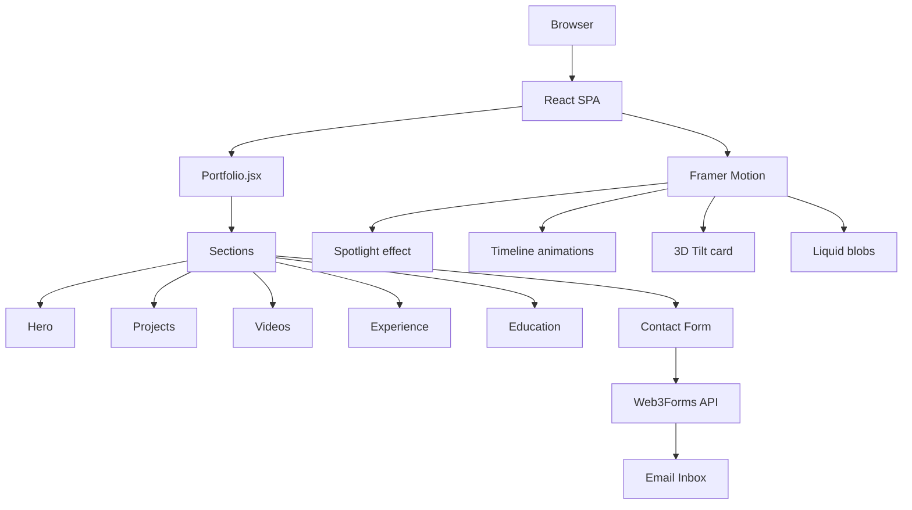
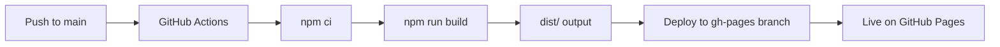

# John Wynter | Personal Portfolio

A personal portfolio site built with React, Vite, Tailwind CSS, and Framer Motion. Deployed to GitHub Pages via GitHub Actions.

**Live:** https://johnjohnw.github.io/personal_portfolio/

---

## Tech Stack

| Layer | Technology |
|---|---|
| Framework | React 18 + Vite |
| Styling | Tailwind CSS v3 |
| Animations | Framer Motion |
| Contact form | Web3Forms API |
| Deployment | GitHub Pages via GitHub Actions |

---

## Architecture



---

## Build and Deploy Pipeline



---

## Project Structure

```
personal_portfolio/
├── public/
│   ├── favicon.ico
│   ├── apple-touch-icon.png
│   ├── headshot.png
│   └── site.webmanifest
├── src/
│   ├── main.jsx          # React entry point
│   ├── App.jsx           # Root component
│   ├── Portfolio.jsx     # Full site — all sections and data
│   └── index.css         # Tailwind base + global styles
├── index.html
├── vite.config.js        # Base path set to /personal_portfolio/
├── tailwind.config.js
└── postcss.config.js
```

---

## Sections

| Section | Description |
|---|---|
| Hero | Name, role, CTA buttons, 3D tilt card |
| Projects | Filterable grid of projects with stack tags and links |
| Videos | Embedded YouTube uploads playlist |
| Experience | Animated timeline with active/past role distinction |
| Education | Animated timeline of QUT degrees |
| Contact | Web3Forms-powered contact form |

---

## Local Development

```bash
npm install
npm run dev
```

Runs at `http://localhost:5173`.

## Build

```bash
npm run build
```

Output goes to `dist/`. The base path is configured in `vite.config.js` as `/personal_portfolio/` for GitHub Pages compatibility.

## Preview built output

```bash
npm run preview
```

Runs at `http://localhost:4173`.

---

## Deployment

Push to `main` — GitHub Actions automatically builds and publishes to the `gh-pages` branch.

The workflow file is at `.github/workflows/` and uses the `BASE_PATH=/personal_portfolio/` environment variable during build.
